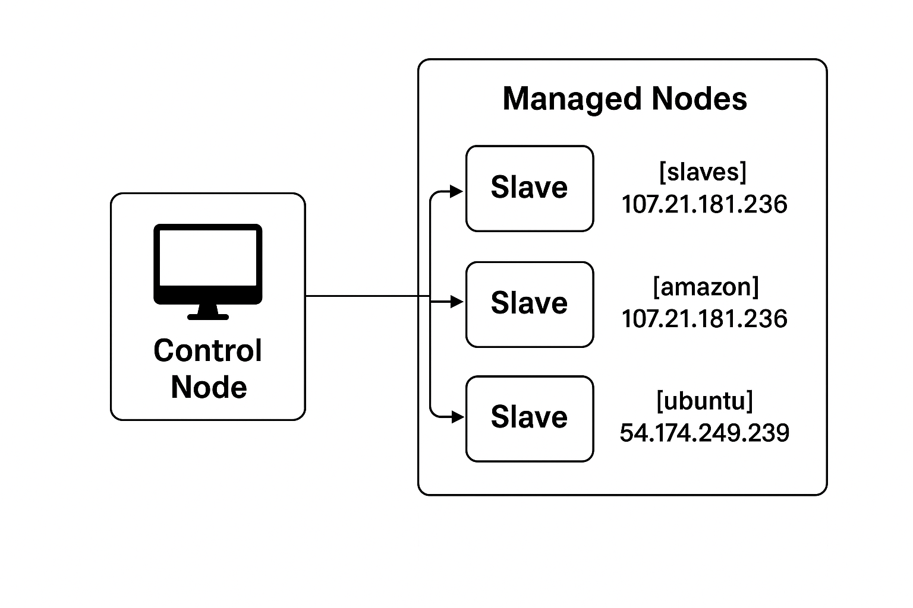

<body>
  

    <header>
      

        <h1>Ansible Projects 🚀</h1>
        
Two Ansible projects: exploring modules and deploying a React app on Apache/HTTPD.

        <nav>
          <a class="chip" href="#overview">Overview</a>
          <a class="chip" href="#architecture">Architecture</a>
          <a class="chip" href="#project1">Project 1</a>
          <a class="chip" href="#project2">Project 2</a>
          <a class="chip" href="#inventory">Inventory</a>
          <a class="chip" href="#commands">Commands</a>
        </nav>
      

    </header>

    <section id="overview" class="card">
      <h2>📌 Overview</h2>
      
This repository contains two Ansible-based automation projects:

      <ol>
        <li><strong>Exploring Ansible Modules</strong> — Installing packages, managing users, copying files, cloning repos, and more.</li>
        <li><strong>Deploying a React App on Apache/HTTPD</strong> — End-to-end deployment of a React portfolio website.</li>
      </ol>
      
Playbooks use Ansible Vault for secrets and host groups are defined in <code>inventory.ini</code>. Put images in <code>images/</code>.

    </section>

    <section id="architecture" class="card">
      <h2>🏗️ How Ansible Works (Architecture)</h2>
      <ul>
        <li><strong>Control Node (Master):</strong> Runs playbooks and connects to targets over SSH.</li>
        <li><strong>Managed Nodes (Slaves):</strong> Targets where modules execute — no agent required.</li>
        <li><strong>Inventory:</strong> Host groups and hosts (in <code>inventory.ini</code>).</li>
        <li><strong>Playbooks:</strong> YAML files that list plays and tasks.</li>
        <li><strong>Modules:</strong> Units of work like <code>yum</code>, <code>apt</code>, <code>user</code>, <code>git</code>, <code>service</code>.</li>
      </ul>

      
<strong>Flow:</strong> Control Node runs playbook → connects via SSH → executes modules → target converges to desired state.

      <h3>Architecture Diagram</h3>

      <!-- Relative path first, onerror uses raw fallback. Replace rawBase if your repo differs. -->
      

      <small class="meta">If the image above fails to load, it will automatically try the raw GitHub URL.</small>
    </section>

    <section id="why" class="card">
      <h2>⚖️ Why Ansible (vs Chef / Puppet)</h2>
      <ul>
        <li><strong>Agentless</strong> — only SSH required.</li>
        <li><strong>Simple syntax</strong> — YAML playbooks are readable and maintainable.</li>
        <li><strong>Fast to adopt</strong> — quick setup and strong community adoption.</li>
        <li><strong>Push model</strong> — control node initiates changes (good for CI/CD).</li>
      </ul>
    </section>

    <section id="structure" class="card">
      <h2>📂 Project Structure</h2>
      <pre><code>.
├── project-1-modules/
│   ├── ansible-playbook.yml
│   ├── vault.yml
│   ├── ansible.cfg
│   └── inventory.ini
│
├── project-2-deploy-react-httpd/
│   ├── ansible-playbook.yml
│   ├── vault.yml
│   ├── ansible.cfg
│   └── inventory.ini
│
├── images/
│   ├── Ansible_Architecture.png
│   ├── project1-output.png
│   ├── project2-output.png
│   └── react-website.png
│
└── README.md
</code></pre>
    </section>

    <section id="project1" class="card">
      <h2>🔹 Project 1 — Playing with Ansible Modules</h2>
      
<strong>Purpose:</strong> Learn modules like <code>yum</code>, <code>apt</code>, <code>user</code>, <code>copy</code>, <code>git</code>, <code>shell</code>, and <code>debug</code>.

      <ul>
        <li>Conditional package installs using <code>ansible_facts['os_family']</code>.</li>
        <li>Create users with correct group/shell.</li>
        <li>Copy files, register command outputs, and show them with <code>debug</code>.</li>
        <li>Clone GitHub repos using secrets from <code>vault.yml</code>.</li>
      </ul>

      <h3>Commands</h3>
      <pre><code># Test connectivity
ansible -i inventory.ini all -m ping

# Run the playbook
ansible-playbook -i inventory.ini ansible-playbook.yml

# Vault
ansible-vault encrypt vault.yml
ansible-vault decrypt vault.yml
ansible-vault edit vault.yml
</code></pre>

      <h3>Sample Output</h3>
      
    </section>

    <section id="project2" class="card">
      <h2>🔹 Project 2 — Deploy React App on Apache/HTTPD</h2>
      
<strong>Purpose:</strong> Automate deploying a React portfolio to Apache (<code>httpd</code> / <code>apache2</code>).

      <ul>
        <li>Install <code>git</code> and <code>httpd</code>/<code>apache2</code> depending on OS family.</li>
        <li>Enable and start the web service.</li>
        <li>Clone React repo to <code>/tmp/website</code> and copy <code>index.html</code> + assets to <code>/var/www/html/</code>.</li>
      </ul>

      <h3>Commands</h3>
      <pre><code># Run deployment (asks for vault password)
ansible-playbook -i inventory.ini ansible-playbook.yml --ask-vault-pass

# Check Apache service on target node
systemctl status httpd   # (RedHat)
systemctl status apache2 # (Debian/Ubuntu)
</code></pre>

      <h3>Sample Output</h3>
      

        
        
      

    </section>

    <section id="states" class="card">
      <h2>📖 Supported States</h2>
      <ul>
        <li><code>present</code> → Install</li>
        <li><code>absent</code> → Remove</li>
        <li><code>latest</code> → Upgrade</li>
        <li><code>started</code>/<code>stopped</code>/<code>restarted</code> → Service control</li>
      </ul>
    </section>

    <section id="commands" class="card">
      <h2>🛠️ Common Commands Summary</h2>
      <pre><code># Ping all hosts
ansible -i inventory.ini all -m ping

# Vault
ansible-vault create vault.yml
ansible-vault encrypt vault.yml
ansible-vault decrypt vault.yml
ansible-vault edit vault.yml

# Run playbook
ansible-playbook -i inventory.ini ansible-playbook.yml --ask-vault-pass
</code></pre>
    </section>

    <section id="inventory" class="card">
      <h2>🔎 Example <code>inventory.ini</code></h2>

      <pre><code>[slaves]
107.21.181.236
54.174.249.239

[amazon]
107.21.181.236

[ubuntu]
54.174.249.239
</code></pre>

      
If you use SSH user/key, add per-host vars or use a <code>group_vars/</code> folder. Example:

      <pre><code>[slaves]
107.21.181.236 ansible_user=ec2-user ansible_ssh_private_key_file=~/.ssh/id_rsa
54.174.249.239 ansible_user=ubuntu   ansible_ssh_private_key_file=~/.ssh/id_rsa
</code></pre>
    </section>

    <footer>
      
Tips: Commit your images in <code>images/</code>, then open this HTML file in the browser. If images still do not load, confirm the filenames, case, and branch.

      
Generated for — <strong>Harshith</strong>

    </footer>
  

  
</body>
</html>
